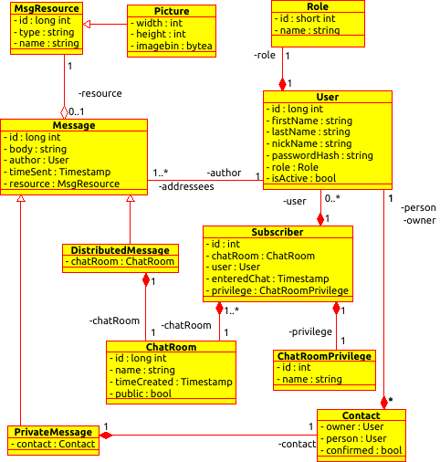

# instant-messenger-webapp-trainig@vironit

training project "instant messenger webapplication" implements basic functionality for: 

<ol>
<li>
 	subscription (sign-up) 
</li>
<li>
 	authorization 
</li>
<li>
 	friend requests (may or may not be approved)
</li>
<li>
 	contacts look up (each user has it's own contact list)
</li>
<li>
  	instant sending/receiving messages
</li>
<li>
  	instant sending/receiving messages in group chats (chatrooms don't require users to have each other in contact list) 
</li>
<li>
  	the messenger supports enclosure of different resources (images) 
</li>
</ol>
 
**stack: Tomcat(v9), Postgres v10, Java(spring-core v.5.x, spring-security v.5.x, hibernate v.5.x, webSockets), Thymeleaf + Bootstrap**
 
 
<strong>UML diagram:</strong>
