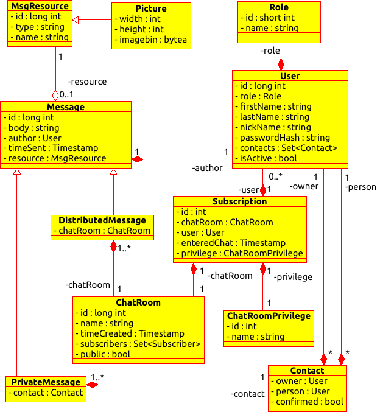

# instant-messenger-webapp-trainig@vironit
***
training project "instant messenger webapplication" implements basic functionality for:

 1. subscription (sign-up) 
 2. authorization 
 3. friend requests (may or may not be approved)
 4. contacts look up (each user has it's own contact list)
 5. chatrooms look up (in case chatroom was created or set to be private)
 6. instant sending/receiving messages
 7. instant sending/receiving messages in group chats (chatrooms don't require users to have each other in contact lists)
 8. the messenger supports enclosure of different resources (images)
 9. administrative tools (delete/ban application users)
 10. chatrooms support different privileges for users (chat administrators and commoners)

**stack: Tomcat(v9), Postgres v10, Java(spring-core v.5.x, spring-security v.5.x, hibernate v.5.x, webSockets), Thymeleaf + Bootstrap**

***
**UML diagram:**
***
